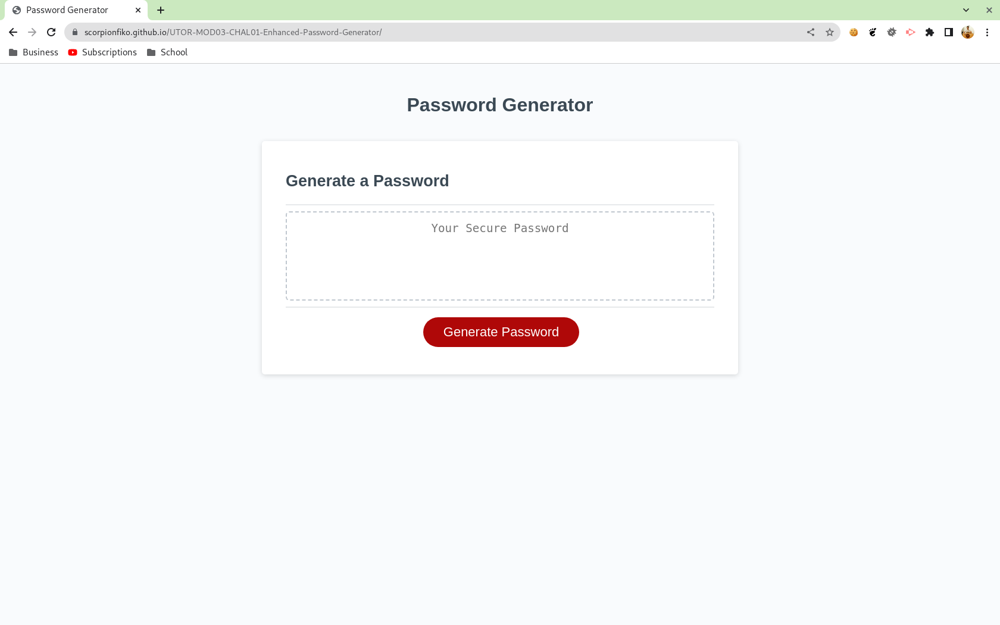
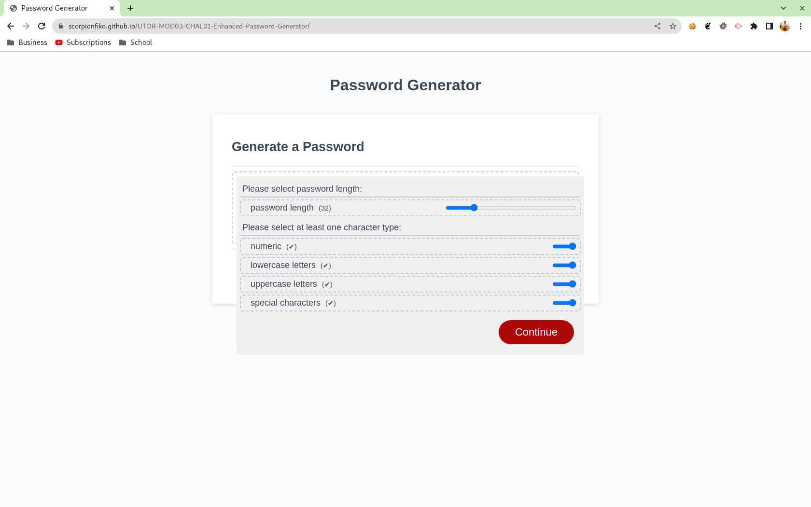
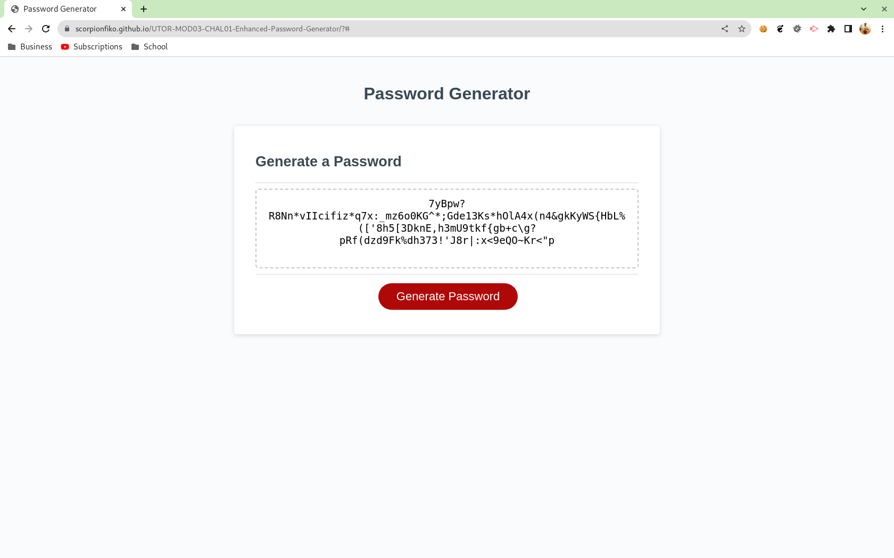

# UTOR-MOD03-CHAL01-Enhanced-Password-Generator
University of Toronto - Module 03 - Challenge 01 - Enhanced Password Generator

## Description

Reporsitory containing the code for the enhanced password generator. The website is done using HTML, CSS, and JavaScript. The Enhanced Password Generator goes beyond just supplying a password to the user. It presents the user with the options to select: 
- password length (between 8 and 128 characters) 
- the character types (numeric, lower case letters, upper case letters, and special character) to be used in the password

The series of prompts for the password legth and character types are presented on the screen via a hidden user form. The form gets displayed to the user once the "generate password" button is pressed. To prevent bad user input, the form uses sliders or inputs of type ranage that the user can modify using the mouse or their finger. The change in the slider value is also immediately displayed on the form. The user must select at least one of the character types in order to generate a password; otherwise the user can not proceed and the border of all character type inputs will turn red brining it up to the user's attention.

If all inputs are in place, a password of supplied length is generated from the selected characters types. Please note: the only special character as per (website) that is ommitted is the space (' '). A leading or trailing space character may mislead the user. In addition, may forms may "trim" the password string (i.e. remove leading or trailing spaces) leading to a wrong password error.  

The hidden user form will appear on top and slightly offest from the exising password box. It is responsive and will modify the look once the screen width is reduced.

Below is the image of the application when the user lands on the page

Below is the image of the application when the user selects the password inputs

Below is the image of the application when the password is generated

## Table of Contents

- [Installation](#installation)
- [Functionality](#functionality)
- [Usage](#usage)
- [Credits](#credits)
- [License](#license)

## Installation

No installation requirements. Click the URL https://scorpionfiko.github.io/UTOR-MOD03-CHAL01-Enhanced-Password-Generator/ to open the webpage in your default browser.

## Functionality
The following discusses at a high level about some of the features of the website. Detailed code implementation can be found as comments in the CSS or JS files.

### Password Selection Form:
- Password length slider: this ranges from 8 to 128 with a default value of 32.
- Character type sliders: they range between 0 and 1 with default value of 1. Zero is considered "false" (i.e. not include that character type). One is considered "true" (i.e. include the character type).
- Labels: to the right of every label there is a small parenthesis indicating the current value. The value is updated immediately upon change of input value. 
- Form: the form is placed on top and slighly offset from the existing password display box. Depending on screen size, the input is displayed in a row or column. 

### CSS:
Additional styling classes have been added to style the form. One existing class has been updated to include a new element that helps with the position of the form. 

### JavaScript (JS):
- Form interaction code: this code is used to get input from the from, update the form upon change of input, add listeners to the input buttons, style the form upon "bad input", etc. The interaction is done via the browser/web API's. 
- Password generation code: this code is used to generate the password and write on the existing password area. The password generation is done using several array methods.

## Usage
For generating a password: 
- go the the application at: https://scorpionfiko.github.io/UTOR-MOD03-CHAL01-Enhanced-Password-Generator/
- click "Generate Password"
- Select the form inputs
    - if all character type inputs are set to "false", their border is highlighed in red and the "continue" button is disabled
- Click the "continue" button to obtain the password from the selected length and character type set

For viewing the responsiveness of the website: 
Method 1:
- Use separate computer, tablet, or phone to access the website

Method 2:
- Access the web page via web browser.
- Right click on the page and select "inspect" to open browswer's developer tools
- Enable the device toolbar if not already enabled
- Use the device toolbar on the right to grow or shrink the viewable area and see how items change

## Credits

N/A

## License

Please refer to the LICENSE in the repo.

## (Un)Known Issues
In the development of the form, <form> element is used and the button is a <button> element. However, when the <button> is pressed, it makes the form act based on the action specified on the form. In this case it is action="#" - i.e. page refresh. Based on this, upon first load of page and first usage of the password generator, the form submits and the page refreshes. This erases the original password the application has provided. Upon subsequent usage, the application behaves properly.

This behaviour was fixed by switching the <button> from the user form to an <input>. Appropriate comments added to the HTML file. Now clicking the button does not submit the form.
